# 🛡️ CleanTalk Coupon & Promo Code 2025: 3 Websites for $20.40 (Save 33%)

[]()
[](https://cleantalk.org/?pid=1078601)
[]()

> **🚨 FLASH SALE ALERT:**  
> **[Get Unlimited Anti-Spam for 3 Websites for just $20.40/Year](https://cleantalk.org/?pid=1078601)**  
> *Regular Price: ~$31. Save $10.80 instantly. No coupon code needed—discount applied automatically via this link.*

---

## 📑 Table of Contents
- [The $20.40 Deal Breakdown](#-the-2040-deal-breakdown)
- [How Spam Destroys SEO (Visualized)](#-how-spam-destroys-seo-visualized)
- [The Savings Formula](#-the-savings-formula)
- [Features & Comparison](#-features--comparison)
- [Installation of Analysis Tool](#-installation-of-analysis-tool)

---

## 💰 The $20.40 Deal Breakdown

Most users buy the single site license (~$10/year). However, the **hidden gem** in CleanTalk's pricing is the 3-site bundle.

| Package | Cost Per Year | Cost Per Site | Savings |
| :--- | :--- | :--- | :--- |
| 1 Website | ~$10.20 | $10.20 | $0 |
| **3 Websites** | **$20.40** | **$6.80** | **✅ Best Value** |
| 5 Websites | ~$30.60 | $6.12 | Good |

**👉 [Click here to activate the 3-Site Bundle Deal](https://cleantalk.org/?pid=1078601)**

---

## 📉 How Spam Destroys SEO (Visualized)

Why is anti-spam critical for ranking on Google? It's about **E-E-A-T** (Experience, Expertise, Authoritativeness, and Trustworthiness).

### ❌ Without CleanTalk (The Infection Cycle)
Spam bots inject malicious links, slowing down your server and destroying your trust score.


### ✅ With CleanTalk (The Protection Shield)
Cloud-based filtering stops bots *before* they even load your website scripts.

```mermaid
graph TD
    A[Traffic Arrives] --> B{CleanTalk Cloud FireWall}
    B -->|Real Human| C[Access Granted]
    B -->|Spam Bot| D[❌ Blocked Instantly]
    
    C --> E[Clean Database]
    C --> F[Fast Page Load]
    E & F --> G[⭐⭐⭐⭐⭐ Improved SEO Score]

    style B fill:#00cc66,stroke:#333,stroke-width:2px,color:#fff
    style G fill:#00cc66,stroke:#333,stroke-width:2px,color:#fff
```



---

## 🧮 The Savings Formula

Manual moderation is expensive. Use our formula to calculate your lost wages.

```math
┌────────────────────────────────────────────────────────────────────────┐
│                        THE LOST WAGE FORMULA                           │
├────────────────────────────────────────────────────────────────────────┤
│                                                                        │
│   ( Spam_Items_Per_Day  ×  Minutes_To_Moderate )  ×  Hourly_Wage       │
│                                                                        │
│   =  💰 MONEY WASTED PER DAY                                           │
│                                                                        │
└────────────────────────────────────────────────────────────────────────┘
```

**Real World Example:**
*   **20** spam comments/day
*   **2** minutes to check/delete each
*   **$50** hourly rate
*   **Result:** You are losing **$12,000+ per year** in billable time.
*   **Solution:** [Pay $20.40 once](https://cleantalk.org/?pid=1078601).

---

## 🚀 Features & Comparison

CleanTalk is a cloud-based service, meaning it doesn't slow down your server like local plugins.

*   **Invisible Protection:** No Captchas, no puzzles.
*   **Real-Time Email Validation:** Checks if an email exists before signup.
*   **Universal:** Works on WordPress, Joomla, PHP, Python, etc.

| Feature | Manual / Free Plugins | [CleanTalk Premium](https://cleantalk.org/?pid=1078601) |
| :--- | :--- | :--- |
| **UX** | Annoying Puzzles | **Invisible** |
| **Accuracy** | Low | **99.998%** |
| **Server Load** | High | **Zero** |
| **Price** | Your Time ($$$) | **$20.40 / Year** |

---


<div align="center">
  <h3>Don't wait until you get hacked.</h3>
  <a href="https://cleantalk.org/?pid=1078601">
    
  </a>
</div>
